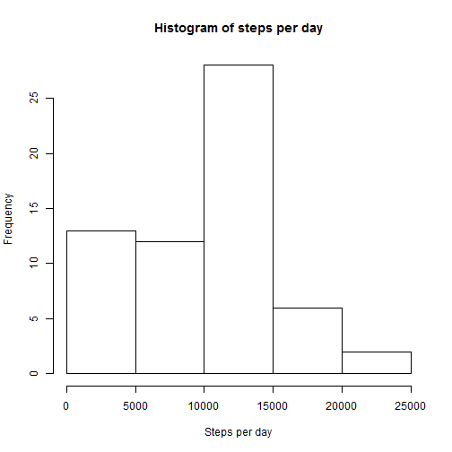
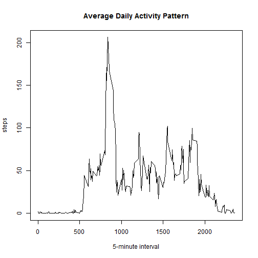
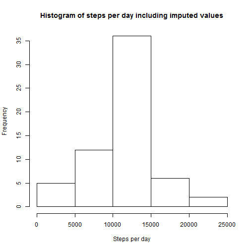
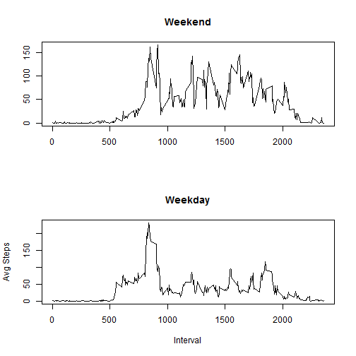

# Reproducible Research: Peer Assessment 1


## Loading and preprocessing the data

Load knitr and ensure code chunks "echo"


```r
library(knitr)
opts_chunk$set(echo = TRUE)
```


Get the CSV file. Transform to data table. Convert date from "factor" to "Date"


```r
library(data.table)
```

```
## Warning: package 'data.table' was built under R version 3.0.3
```

```r
AT <- fread("activity/activity.csv", sep = ",")
AT[, `:=`(date, as.Date(date, format = "%Y-%m-%d"))]
```

```
##        steps       date interval
##     1:    NA 2012-10-01        0
##     2:    NA 2012-10-01        5
##     3:    NA 2012-10-01       10
##     4:    NA 2012-10-01       15
##     5:    NA 2012-10-01       20
##    ---                          
## 17564:    NA 2012-11-30     2335
## 17565:    NA 2012-11-30     2340
## 17566:    NA 2012-11-30     2345
## 17567:    NA 2012-11-30     2350
## 17568:    NA 2012-11-30     2355
```


## What is mean total number of steps taken per day?

Plot a histogram of totals steps per day:


```r
s <- tapply(AT[, steps], AT[, date], sum, na.rm = T)
hist(s, main = "Histogram of steps per day", xlab = "Steps per day")
```

 


Give the mean and median steps per day:


```r
mean(s)
```

```
## [1] 9354
```

```r
median(s)
```

```
## [1] 10395
```


## What is the average daily activity pattern?


```r
t <- tapply(AT[, steps], AT[, interval], mean, na.rm = T)
plot(names(t), t, type = "l", main = "Average Daily Activity Pattern", xlab = "5-minute interval", 
    ylab = "steps")
```

 


Which interval, on average, contains the highest number of steps?


```r
names(t[t == max(t)])
```

```
## [1] "835"
```


## Imputing missing values

How many values are missing? Impute the missing values and create a dataset including the imputed values where the missing values were.


```r
length(AT[is.na(AT$steps), ][[1]])
```

```
## [1] 2304
```

```r
AT[, `:=`(intmean, round(mean(steps, na.rm = T))), by = interval]
```

```
##        steps       date interval intmean
##     1:    NA 2012-10-01        0       2
##     2:    NA 2012-10-01        5       0
##     3:    NA 2012-10-01       10       0
##     4:    NA 2012-10-01       15       0
##     5:    NA 2012-10-01       20       0
##    ---                                  
## 17564:    NA 2012-11-30     2335       5
## 17565:    NA 2012-11-30     2340       3
## 17566:    NA 2012-11-30     2345       1
## 17567:    NA 2012-11-30     2350       0
## 17568:    NA 2012-11-30     2355       1
```

```r
AT[is.na(steps), `:=`(steps, intmean)]
```

```
## Warning: Coerced 'double' RHS to 'integer' to match the column's type; may
## have truncated precision. Either change the target column to 'double'
## first (by creating a new 'double' vector length 17568 (nrows of entire
## table) and assign that; i.e. 'replace' column), or coerce RHS to 'integer'
## (e.g. 1L, NA_[real|integer]_, as.*, etc) to make your intent clear and for
## speed. Or, set the column type correctly up front when you create the
## table and stick to it, please.
```

```
##        steps       date interval intmean
##     1:     2 2012-10-01        0       2
##     2:     0 2012-10-01        5       0
##     3:     0 2012-10-01       10       0
##     4:     0 2012-10-01       15       0
##     5:     0 2012-10-01       20       0
##    ---                                  
## 17564:     5 2012-11-30     2335       5
## 17565:     3 2012-11-30     2340       3
## 17566:     1 2012-11-30     2345       1
## 17567:     0 2012-11-30     2350       0
## 17568:     1 2012-11-30     2355       1
```


Plot a histogram and show mean and median values for the dataset with the imputed values. Compare to the values from the original data:


```r
s <- tapply(AT[, steps], AT[, date], sum, na.rm = T)
hist(s, main = "Histogram of steps per day including imputed values", xlab = "Steps per day")
```

 

```r
mean(s)
```

```
## [1] 10766
```

```r
median(s)
```

```
## [1] 10762
```


## Are there differences in activity patterns between weekdays and weekends?


```r
AT[, `:=`(wkdy, weekdays(date))]
```

```
##        steps       date interval intmean   wkdy
##     1:     2 2012-10-01        0       2 Monday
##     2:     0 2012-10-01        5       0 Monday
##     3:     0 2012-10-01       10       0 Monday
##     4:     0 2012-10-01       15       0 Monday
##     5:     0 2012-10-01       20       0 Monday
##    ---                                         
## 17564:     5 2012-11-30     2335       5 Friday
## 17565:     3 2012-11-30     2340       3 Friday
## 17566:     1 2012-11-30     2345       1 Friday
## 17567:     0 2012-11-30     2350       0 Friday
## 17568:     1 2012-11-30     2355       1 Friday
```

```r
AT[wkdy %in% c("Saturday", "Sunday"), `:=`(daytype, "Weekend")]
```

```
##        steps       date interval intmean   wkdy daytype
##     1:     2 2012-10-01        0       2 Monday      NA
##     2:     0 2012-10-01        5       0 Monday      NA
##     3:     0 2012-10-01       10       0 Monday      NA
##     4:     0 2012-10-01       15       0 Monday      NA
##     5:     0 2012-10-01       20       0 Monday      NA
##    ---                                                 
## 17564:     5 2012-11-30     2335       5 Friday      NA
## 17565:     3 2012-11-30     2340       3 Friday      NA
## 17566:     1 2012-11-30     2345       1 Friday      NA
## 17567:     0 2012-11-30     2350       0 Friday      NA
## 17568:     1 2012-11-30     2355       1 Friday      NA
```

```r
AT[wkdy %in% c("Monday", "Tuesday", "Wednesday", "Thursday", "Friday"), `:=`(daytype, 
    "Weekday")]
```

```
##        steps       date interval intmean   wkdy daytype
##     1:     2 2012-10-01        0       2 Monday Weekday
##     2:     0 2012-10-01        5       0 Monday Weekday
##     3:     0 2012-10-01       10       0 Monday Weekday
##     4:     0 2012-10-01       15       0 Monday Weekday
##     5:     0 2012-10-01       20       0 Monday Weekday
##    ---                                                 
## 17564:     5 2012-11-30     2335       5 Friday Weekday
## 17565:     3 2012-11-30     2340       3 Friday Weekday
## 17566:     1 2012-11-30     2345       1 Friday Weekday
## 17567:     0 2012-11-30     2350       0 Friday Weekday
## 17568:     1 2012-11-30     2355       1 Friday Weekday
```

```r
ATwkday <- AT[daytype == "Weekday", ]
ATwkend <- AT[daytype == "Weekend", ]
wdayavgsteps <- tapply(ATwkday[, steps], ATwkday[, interval], mean)
wendavgsteps <- tapply(ATwkend[, steps], ATwkend[, interval], mean)
xlabels <- names(wendavgsteps)
par(mfrow = c(2, 1))
plot(xlabels, wendavgsteps, type = "l", main = "Weekend", xlab = "", ylab = "")
plot(xlabels, wdayavgsteps, type = "l", main = "Weekday", xlab = "Interval", 
    ylab = "Avg Steps")
```

 

```r
dev.off()
```

```
## null device 
##           1
```


